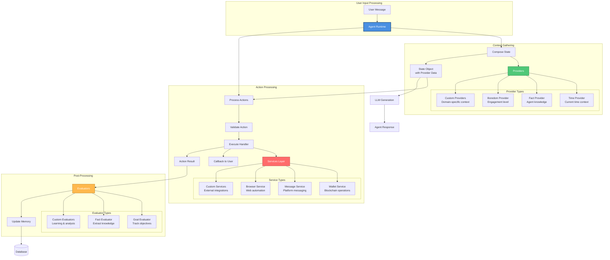
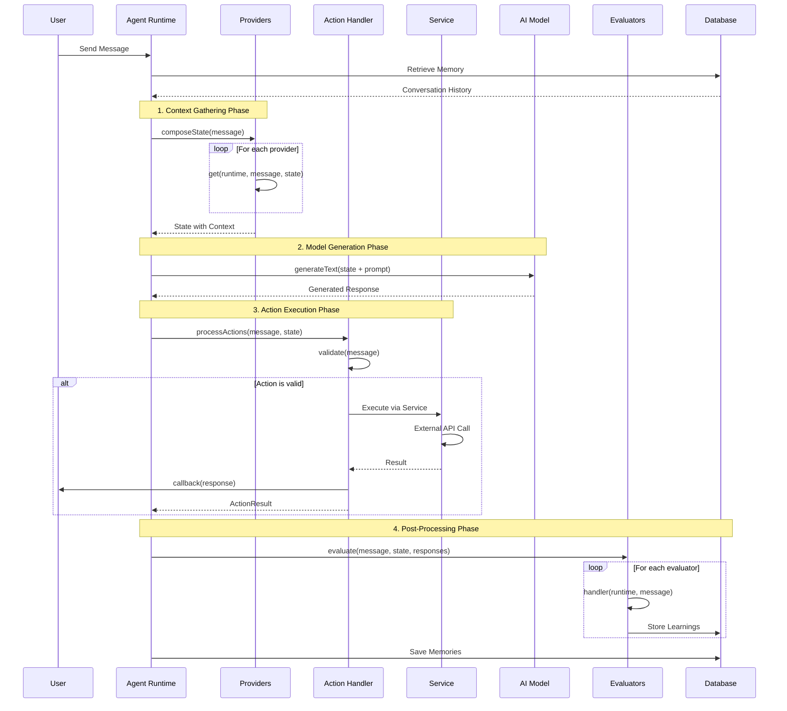
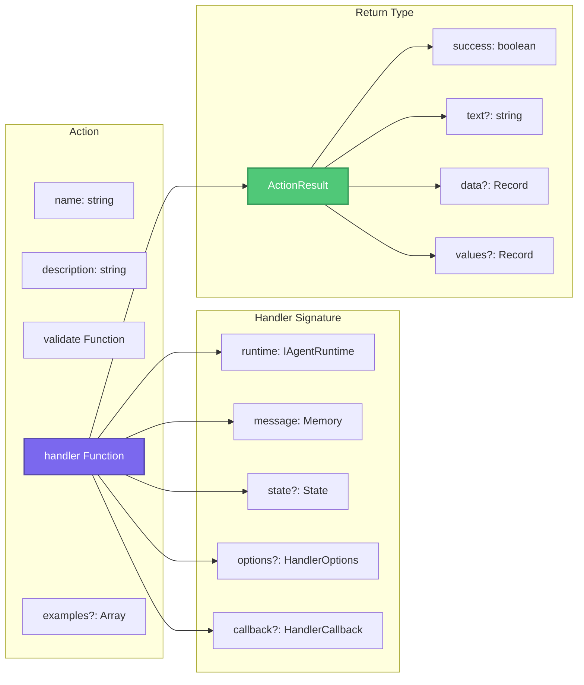
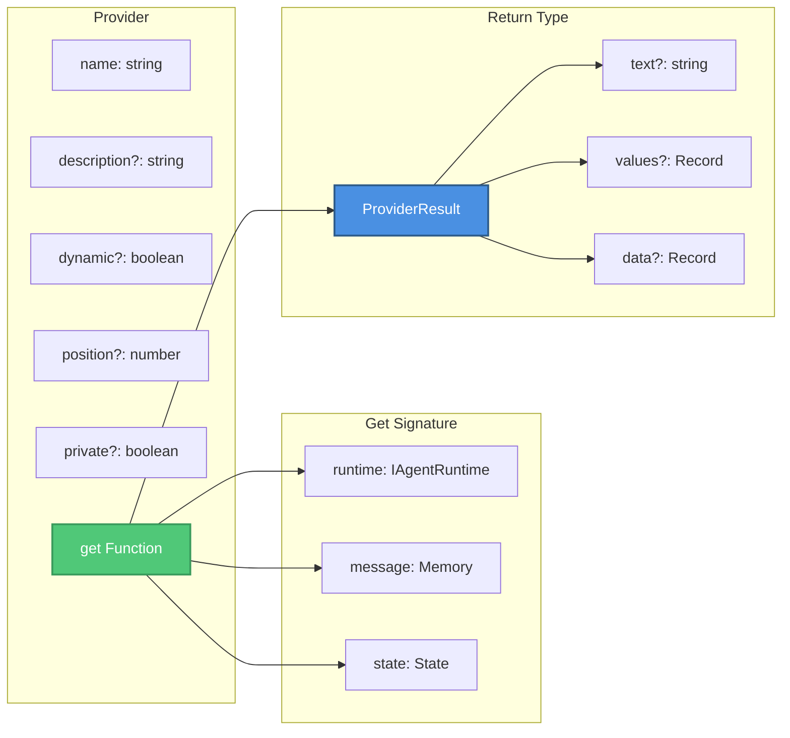
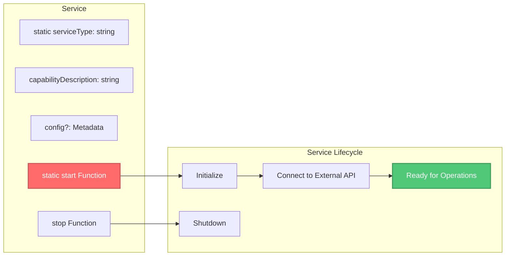
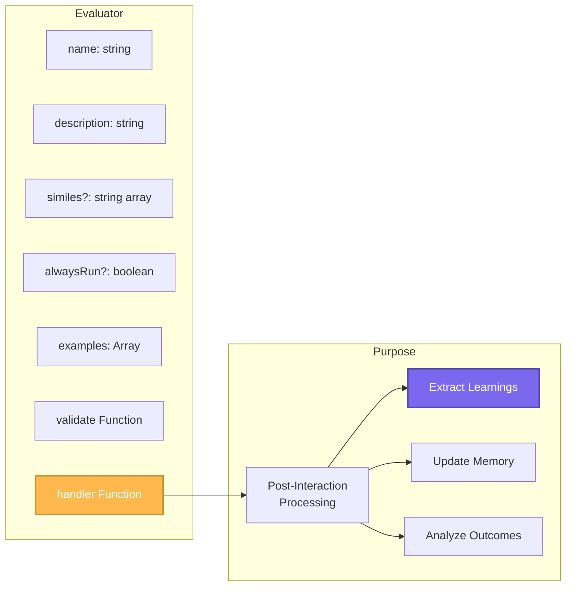
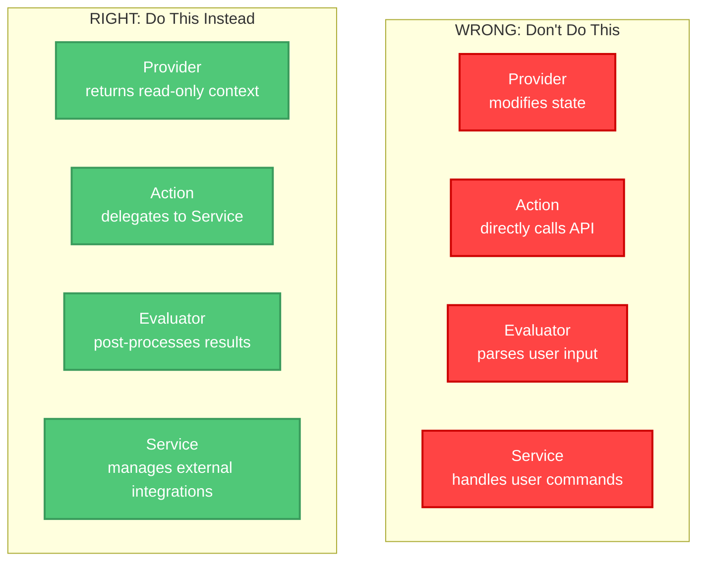

# ElizaOS - Component Interactions

This diagram shows how Actions, Providers, Evaluators, and Services interact within the ElizaOS runtime.

## Component Type Overview



## Interaction Flow Sequence



## Component Contracts

### Action Interface


### Provider Interface


### Service Abstract Class


### Evaluator Interface


## Critical Distinctions

### ❌ Common Mistakes



### Correct Architecture Pattern

```
User Input → Action → Service → External API/SDK
                ↓
            Provider → Context for Prompts
                ↓
        Post-Interaction → Evaluator → Learning/Memory
```

### Component Responsibilities

| Component | Purpose | State Management | External APIs |
|-----------|---------|------------------|---------------|
| **Action** | Handle user commands | ❌ Stateless | ❌ Via Services only |
| **Provider** | Supply context | ❌ Read-only | ❌ No API calls |
| **Service** | External integrations | ✅ Stateful | ✅ Direct API access |
| **Evaluator** | Post-processing | ✅ Can update memory | ❌ Analysis only |

## Example: Correct Implementation

### Action Handler Pattern
```typescript
// ✅ CORRECT: Action delegates to Service
handler: async (runtime, message, state, options, callback): Promise<ActionResult> => {
  // 1. Get service
  const walletService = runtime.getService<WalletService>('wallet');

  // 2. Execute via service
  const result = await walletService.transfer(params);

  // 3. Send user feedback via callback
  await callback({
    text: `Transfer successful: ${result.txHash}`,
    action: 'TRANSFER',
  });

  // 4. Return ActionResult for chaining
  return {
    success: true,
    text: 'Transfer completed',
    values: { txHash: result.txHash },
    data: { operation: 'transfer', result },
  };
}
```

### Provider Pattern
```typescript
// ✅ CORRECT: Provider returns read-only context
get: async (runtime, message, state): Promise<ProviderResult> => {
  const currentTime = new Date().toISOString();
  const timezone = Intl.DateTimeFormat().resolvedOptions().timeZone;

  return {
    text: `Current time: ${currentTime} (${timezone})`,
    values: {
      timestamp: currentTime,
      timezone: timezone,
    },
    data: {
      unix: Date.now(),
    },
  };
}
```

### Service Pattern
```typescript
// ✅ CORRECT: Service manages external integration
class WalletService extends Service {
  static serviceType = 'wallet';
  private provider: Provider;

  static async start(runtime: IAgentRuntime): Promise<Service> {
    const service = new WalletService(runtime);
    await service.connect();
    return service;
  }

  async transfer(params: TransferParams): Promise<TransferResult> {
    // Direct external API interaction
    const tx = await this.provider.sendTransaction(params);
    return { txHash: tx.hash };
  }
}
```

## Related Diagrams

- [High-Level Architecture](./architecture-high-level.md) - System overview
- [Monorepo Structure](./architecture-monorepo.md) - Package organization
- [Runtime & Plugin Architecture](./architecture-runtime-plugins.md) - Detailed plugin system
- [Memory & UUID System](./architecture-memory.md) - Agent memory architecture
- [Architecture Overview](./architecture-overview.md) - Index of all diagrams
