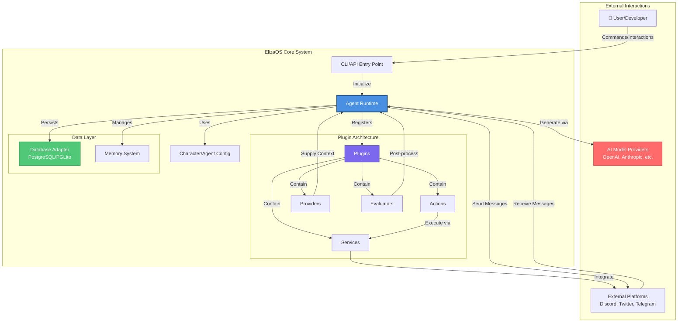

# ElizaOS - High-Level Architecture

This diagram provides an overview of the ElizaOS system architecture, showing how the main components interact.

## Key Components

### Agent Runtime
The central orchestrator that manages all agent operations, including:
- Plugin registration and lifecycle
- State composition and management
- Model interaction and text generation
- Action processing and evaluation
- Memory persistence and retrieval

### Plugins
Modular extensions that provide:
- **Actions**: User-facing commands and interactions
- **Providers**: Read-only context suppliers (time, facts, etc.)
- **Evaluators**: Post-interaction learning and analysis
- **Services**: Stateful integrations with external systems

### Data Layer
- **Database Adapter**: Interface for PostgreSQL or PGLite storage
- **Memory System**: Deterministic UUID-based memory with room/world mapping

### Character Configuration
JSON-based agent personality, knowledge, and behavior definition

## Related Diagrams

- [Monorepo Structure](./architecture-monorepo.md) - Package organization
- [Runtime & Plugin Architecture](./architecture-runtime-plugins.md) - Detailed plugin system
- [Component Interactions](./architecture-components.md) - Actions, Providers, Evaluators, Services
- [Memory & UUID System](./architecture-memory.md) - Agent memory architecture
- [Architecture Overview](./architecture-overview.md) - Index of all diagrams
