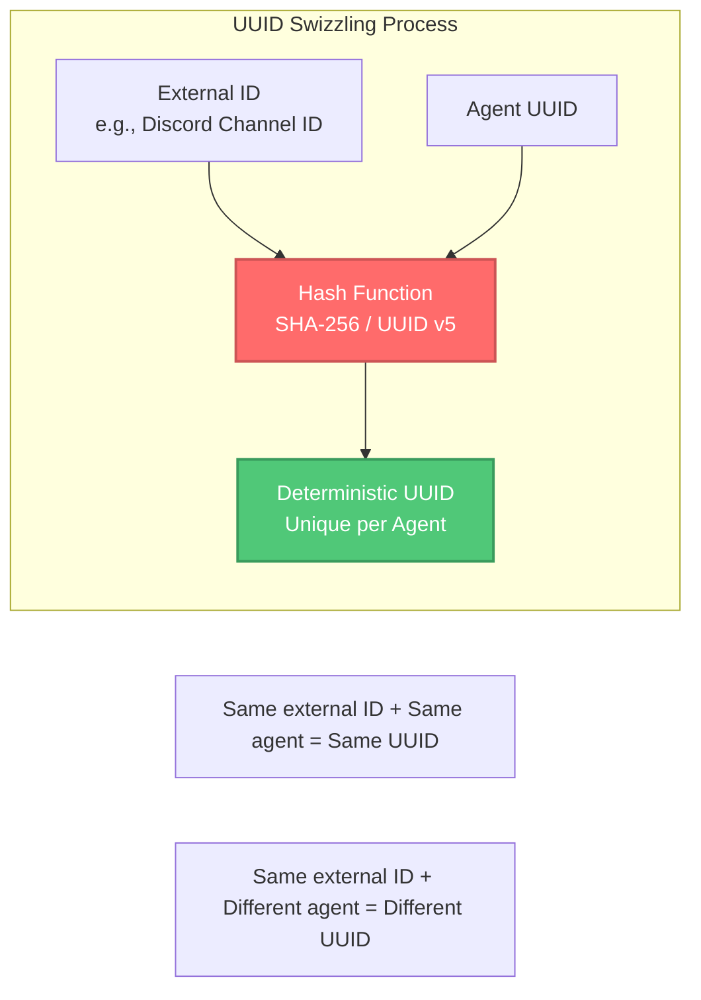
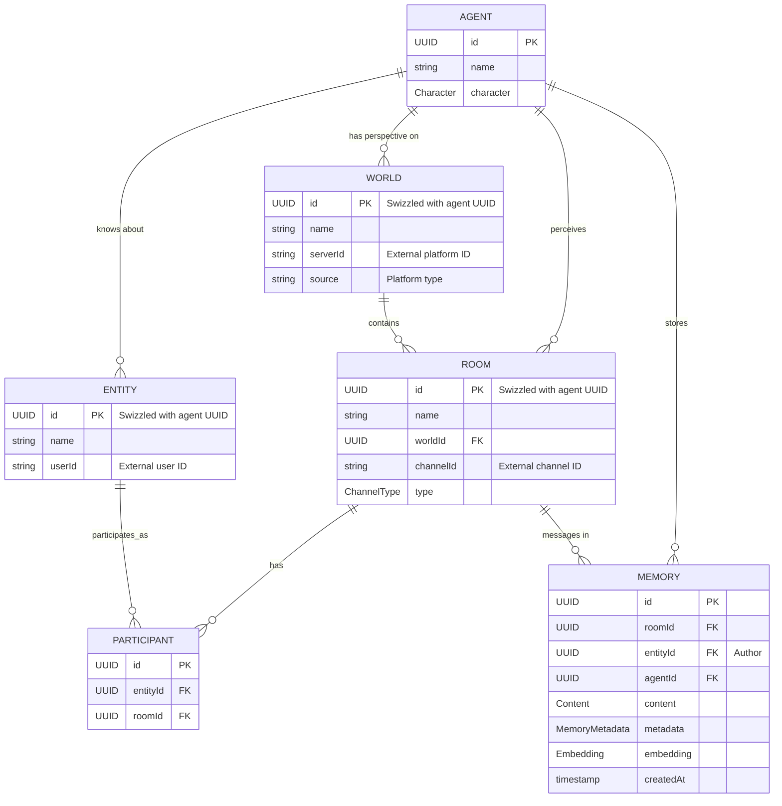
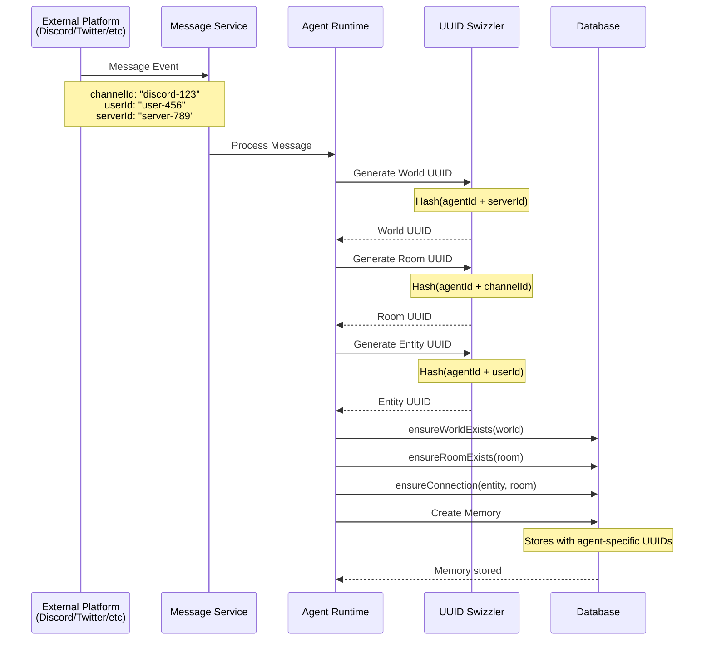
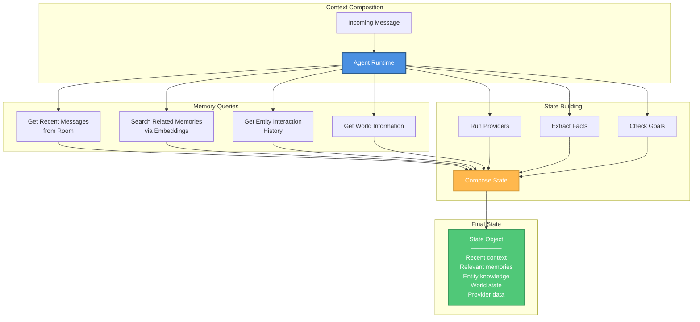
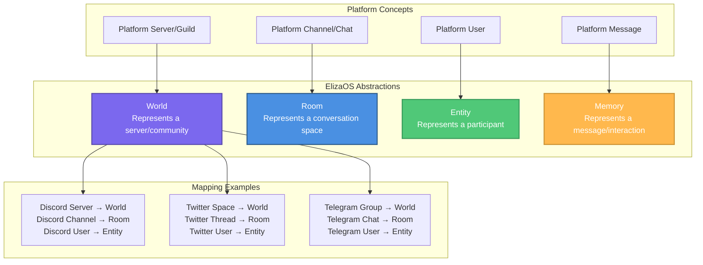
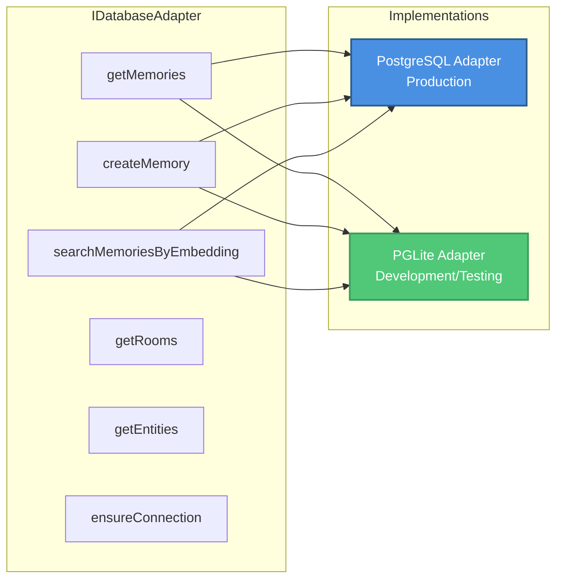

# ElizaOS - Memory & UUID System

This diagram illustrates the agent memory architecture and deterministic UUID system that enables consistent agent perspective across environments.

## Memory Architecture Overview

```mermaid
graph TB
    subgraph "External Platform"
        Discord[Discord Server]
        DiscordChannel[#general Channel]
        DiscordUser[User: Alice]
    end

    subgraph "Agent Perspective Mapping"
        World[World<br/>Discord Server → World UUID<br/>Swizzled with Agent UUID]
        Room[Room<br/>Channel → Room UUID<br/>Swizzled with Agent UUID]
        Entity[Entity<br/>User → Entity UUID<br/>Swizzled with Agent UUID]
    end

    subgraph "Agent A Runtime"
        AgentA[Agent A<br/>UUID: agent-a-uuid]
        WorldA[World UUID A<br/>f(agent-a-uuid + server-id)]
        RoomA[Room UUID A<br/>f(agent-a-uuid + channel-id)]
        EntityA[Entity UUID A<br/>f(agent-a-uuid + user-id)]
        MemoryA[(Agent A Memory)]
    end

    subgraph "Agent B Runtime"
        AgentB[Agent B<br/>UUID: agent-b-uuid]
        WorldB[World UUID B<br/>f(agent-b-uuid + server-id)]
        RoomB[Room UUID B<br/>f(agent-b-uuid + channel-id)]
        EntityB[Entity UUID B<br/>f(agent-b-uuid + user-id)]
        MemoryB[(Agent B Memory)]
    end

    Discord --> World
    DiscordChannel --> Room
    DiscordUser --> Entity

    World --> WorldA
    World --> WorldB
    Room --> RoomA
    Room --> RoomB
    Entity --> EntityA
    Entity --> EntityB

    WorldA --> MemoryA
    RoomA --> MemoryA
    EntityA --> MemoryA

    WorldB --> MemoryB
    RoomB --> MemoryB
    EntityB --> MemoryB

    style AgentA fill:#4A90E2,stroke:#2E5C8A,stroke-width:3px,color:#fff
    style AgentB fill:#7B68EE,stroke:#5A4BAD,stroke-width:3px,color:#fff
    style MemoryA fill:#50C878,stroke:#3A9B5C,stroke-width:2px,color:#fff
    style MemoryB fill:#FFB84D,stroke:#CC9333,stroke-width:2px,color:#fff
```

## Deterministic UUID Generation



## Memory Types and Relationships



## Memory Flow



## Memory Retrieval and Context



## Environment Abstractions



## Key Principles

### Agent-Centric Perspective
Every agent has its own unique perspective on the world:
- **Same Discord server** → Different World UUID per agent
- **Same channel** → Different Room UUID per agent
- **Same user** → Different Entity UUID per agent

### Deterministic UUIDs
UUIDs are generated deterministically:
```
World UUID = hash(agentUUID + externalServerId)
Room UUID = hash(agentUUID + externalChannelId)
Entity UUID = hash(agentUUID + externalUserId)
```

### Benefits
- **Consistency**: Same external entity always maps to same UUID for an agent
- **Isolation**: Each agent has independent memory perspective
- **Portability**: Agent can move between environments and maintain context
- **Debugging**: Deterministic IDs make debugging easier

### Memory Isolation
- Each agent stores memories with its own UUID namespace
- Agents cannot access each other's memories directly
- Shared external events create separate memories per agent

## Database Adapter Interface



## Memory Content Structure

```typescript
interface Memory {
  id: UUID;                    // Message UUID
  roomId: UUID;                // Room UUID (agent-specific)
  entityId: UUID;              // Author Entity UUID (agent-specific)
  agentId: UUID;               // Agent UUID
  content: Content;            // Message content
  metadata: MemoryMetadata;    // Additional data
  embedding?: number[];        // Vector embedding for search
  createdAt: Date;            // Timestamp
}

interface Content {
  text: string;                // Main text content
  action?: string;             // Associated action
  source?: string;             // Origin platform
  url?: string;                // Related URL
  inReplyTo?: UUID;           // Reply reference
  attachments?: Attachment[];  // Files, images, etc.
}
```

## Related Diagrams

- [High-Level Architecture](./architecture-high-level.md) - System overview
- [Monorepo Structure](./architecture-monorepo.md) - Package organization
- [Runtime & Plugin Architecture](./architecture-runtime-plugins.md) - Detailed plugin system
- [Component Interactions](./architecture-components.md) - Actions, Providers, Evaluators, Services
- [Architecture Overview](./architecture-overview.md) - Index of all diagrams
