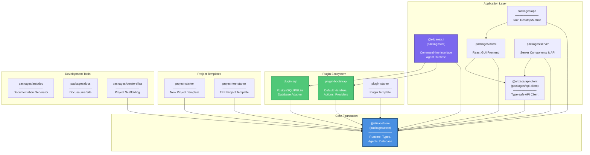

# ElizaOS - Monorepo Structure

This diagram shows the package organization and dependencies within the ElizaOS monorepo.



## Package Dependency Rules

### Workspace Dependencies
All internal `@elizaos/` packages **MUST** use `workspace:*` in `package.json`:

```json
{
  "dependencies": {
    "@elizaos/core": "workspace:*",
    "@elizaos/plugin-sql": "workspace:*"
  }
}
```

### Central Dependency Pattern
- **Everything depends on `@elizaos/core`**
- **Core cannot depend on other packages** (no circular dependencies)
- Import pattern: Use `@elizaos/core` in package code

## Package Categories

### Core Foundation
- **`@elizaos/core`**: Foundation runtime, types, agents, database interfaces

### Application Layer
- **`@elizaos/cli`**: Command-line interface and agent runtime
- **`packages/client`**: React GUI frontend
- **`packages/app`**: Tauri-based desktop/mobile application
- **`packages/server`**: Server components and REST API
- **`@elizaos/api-client`**: Type-safe client for ElizaOS server API

### Plugin Ecosystem
- **`plugin-bootstrap`**: Default event handlers, actions, and providers
- **`plugin-sql`**: DatabaseAdapter implementations (PostgreSQL, PGLite)
- **`plugin-starter`**: Template for creating new plugins

### Project Templates
- **`project-starter`**: Template for new ElizaOS projects
- **`project-tee-starter`**: TEE (Trusted Execution Environment) project template

### Development Tools
- **`packages/autodoc`**: Automated documentation generation
- **`packages/docs`**: Official documentation (Docusaurus)
- **`packages/create-eliza`**: Project scaffolding CLI tool

## Build System

### Tools
- **Package Manager**: `bun` (NEVER use npm or pnpm)
- **Monorepo Tool**: Turbo + Lerna
- **TypeScript**: Shared tsconfig across all packages

### Common Commands
```bash
bun install              # Install dependencies
bun run build            # Build all packages
bun run build:core       # Build core package
bun test                 # Run all tests
```

## Related Diagrams

- [High-Level Architecture](./architecture-high-level.md) - System overview
- [Runtime & Plugin Architecture](./architecture-runtime-plugins.md) - Detailed plugin system
- [Component Interactions](./architecture-components.md) - Actions, Providers, Evaluators, Services
- [Memory & UUID System](./architecture-memory.md) - Agent memory architecture
- [Architecture Overview](./architecture-overview.md) - Index of all diagrams
