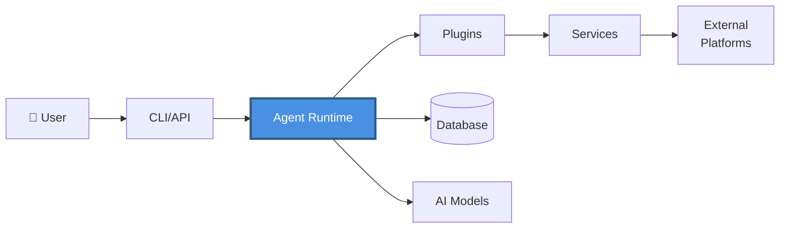
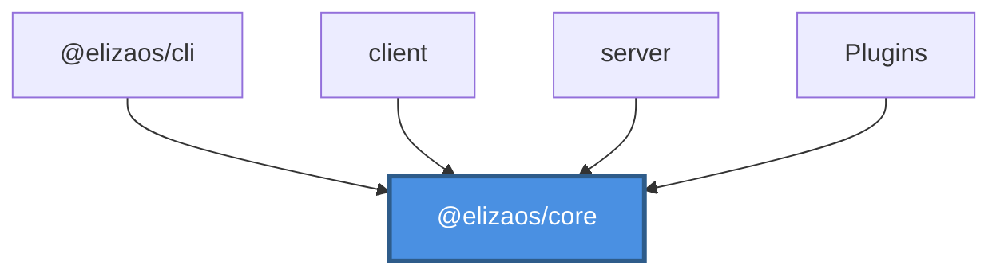
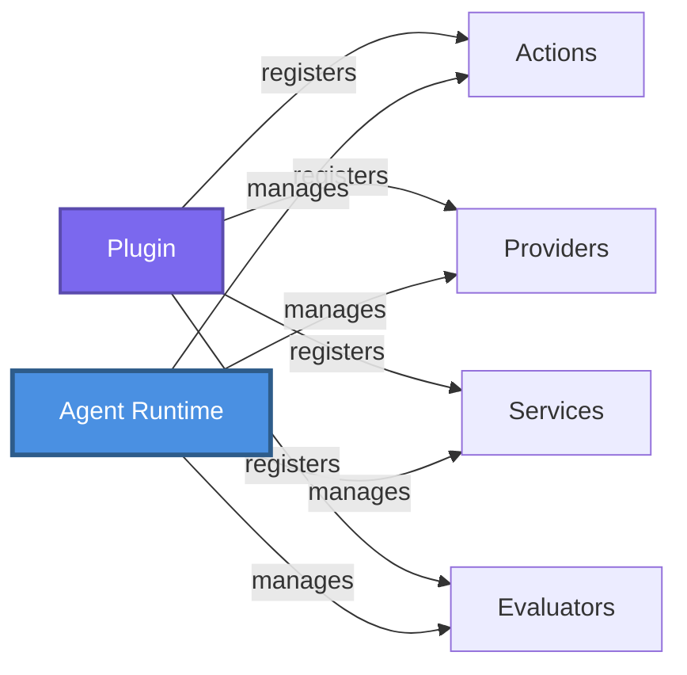
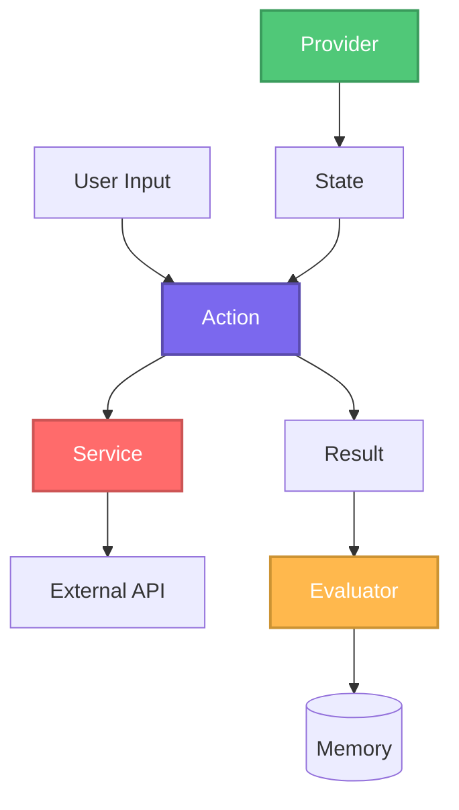
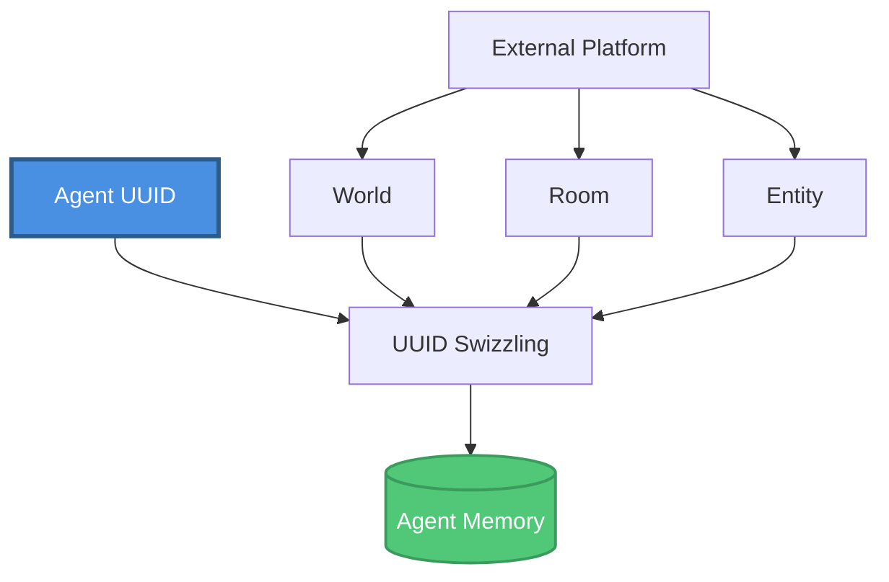
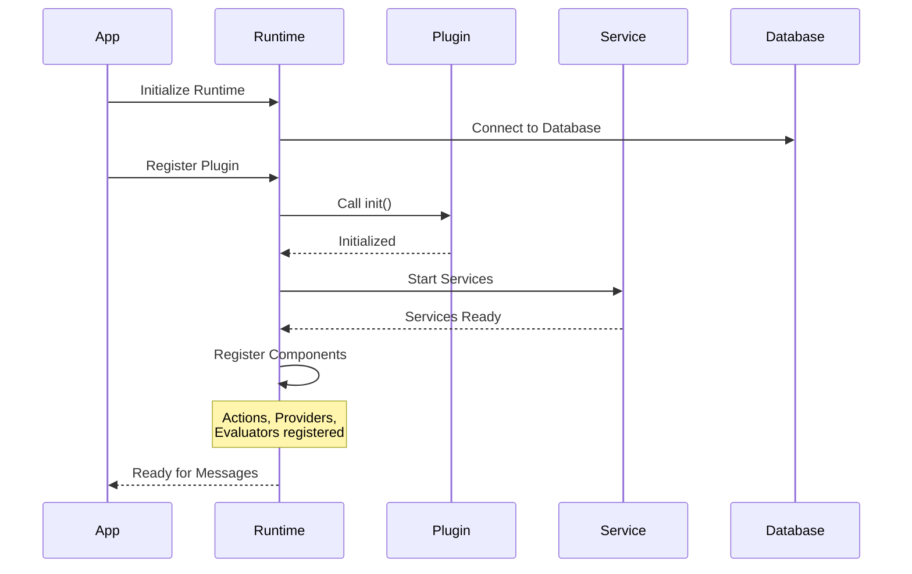

# ElizaOS - Architecture Documentation

Welcome to the ElizaOS architecture documentation. This guide provides comprehensive diagrams illustrating the system's design, from high-level overview to detailed component interactions.

## Quick Navigation

### 🎯 Start Here
- **New to ElizaOS?** → [High-Level Architecture](#high-level-architecture)
- **Understanding the codebase?** → [Monorepo Structure](#monorepo-structure)
- **Building plugins?** → [Runtime & Plugin Architecture](#runtime--plugin-architecture)
- **Component design questions?** → [Component Interactions](#component-interactions)
- **Memory system?** → [Memory & UUID System](#memory--uuid-system)

---

## Architecture Diagrams

### High-Level Architecture
**File**: [architecture-high-level.md](./architecture-high-level.md)

**What it covers:**
- Overall system architecture
- Main component interactions
- External integrations (AI models, platforms)
- Data flow overview

**Best for:**
- Understanding the big picture
- Explaining ElizaOS to others
- Architectural decision-making
- System integration planning

**Key concepts:**
- Agent Runtime as central orchestrator
- Plugin-based architecture
- Database and memory persistence
- External platform integrations



---

### Monorepo Structure
**File**: [architecture-monorepo.md](./architecture-monorepo.md)

**What it covers:**
- Package organization
- Dependency relationships
- Workspace structure
- Build system architecture

**Best for:**
- Setting up development environment
- Understanding package dependencies
- Adding new packages
- Build and deployment decisions

**Key concepts:**
- Core as foundation for all packages
- Workspace dependencies (`workspace:*`)
- Plugin ecosystem organization
- Development tools and templates



---

### Runtime & Plugin Architecture
**File**: [architecture-runtime-plugins.md](./architecture-runtime-plugins.md)

**What it covers:**
- Agent Runtime internals
- Plugin registration and lifecycle
- Component registries
- Service management

**Best for:**
- Building plugins
- Understanding runtime behavior
- Service implementation
- Event system integration

**Key concepts:**
- Plugin interface structure
- Component registration flow
- Service registry pattern
- Plugin lifecycle management



---

### Component Interactions
**File**: [architecture-components.md](./architecture-components.md)

**What it covers:**
- Actions, Providers, Evaluators, Services
- Component interaction flow
- Correct usage patterns
- Common mistakes to avoid

**Best for:**
- Implementing actions
- Creating providers
- Building services
- Understanding evaluators

**Key concepts:**
- Action → Service delegation pattern
- Provider read-only context supply
- Service stateful integration management
- Evaluator post-processing flow



---

### Memory & UUID System
**File**: [architecture-memory.md](./architecture-memory.md)

**What it covers:**
- Agent memory architecture
- Deterministic UUID generation
- World/Room/Entity mapping
- Database adapter interface

**Best for:**
- Understanding agent perspective
- Memory system implementation
- Database integration
- Platform abstraction design

**Key concepts:**
- Agent-centric perspective
- UUID swizzling with agent ID
- Platform → ElizaOS abstraction mapping
- Memory isolation between agents



---

## Diagram Cross-Reference

### By Use Case

#### "I'm building a new plugin"
1. Start: [Runtime & Plugin Architecture](./architecture-runtime-plugins.md)
2. Then: [Component Interactions](./architecture-components.md)
3. Reference: [High-Level Architecture](./architecture-high-level.md)

#### "I need to understand the codebase"
1. Start: [Monorepo Structure](./architecture-monorepo.md)
2. Then: [High-Level Architecture](./architecture-high-level.md)
3. Deep dive: [Runtime & Plugin Architecture](./architecture-runtime-plugins.md)

#### "I'm implementing an action"
1. Start: [Component Interactions](./architecture-components.md)
2. Reference: [Runtime & Plugin Architecture](./architecture-runtime-plugins.md)
3. Context: [Memory & UUID System](./architecture-memory.md)

#### "I'm working with memory/database"
1. Start: [Memory & UUID System](./architecture-memory.md)
2. Reference: [High-Level Architecture](./architecture-high-level.md)
3. Context: [Component Interactions](./architecture-components.md)

#### "I'm integrating a new platform"
1. Start: [Memory & UUID System](./architecture-memory.md)
2. Then: [Component Interactions](./architecture-components.md)
3. Reference: [Runtime & Plugin Architecture](./architecture-runtime-plugins.md)

---

## Architecture Principles

### 1. Core-Centric Design
All packages depend on `@elizaos/core`, but core has no dependencies on other packages. This ensures:
- Clear separation of concerns
- No circular dependencies
- Easy to understand dependency graph

### 2. Plugin-Based Extensibility
Functionality is added through plugins, not by modifying core:
- Plugins are self-contained
- Runtime manages plugin lifecycle
- Components registered at initialization

### 3. Service-Oriented State Management
Stateful operations managed through services:
- Actions are stateless, delegate to services
- Services maintain connections and state
- Accessed via `runtime.getService()`

### 4. Agent-Centric Perspective
Everything viewed from agent's perspective:
- Deterministic UUIDs per agent
- Memory isolation between agents
- Platform abstractions (World, Room, Entity)

### 5. Component Separation
Clear roles for each component type:
- **Actions**: Handle user interactions
- **Providers**: Supply read-only context
- **Services**: Manage external integrations
- **Evaluators**: Post-process for learning

---

## Component Lifecycle



---

## Technology Stack

### Core Technologies
- **Language**: TypeScript
- **Runtime**: Bun (NOT Node.js)
- **Database**: PostgreSQL / PGLite
- **ORM**: Drizzle
- **Monorepo**: Turbo + Lerna

### Key Libraries
- **AI Models**: OpenAI, Anthropic SDKs
- **Process Execution**: `Bun.spawn()` (NOT execa)
- **Events**: EventTarget (NOT EventEmitter)

### Build & Development
- **Package Manager**: `bun` exclusively
- **Test Framework**: `bun:test` exclusively
- **Build Tool**: Turbo
- **Type Checking**: TypeScript strict mode

---

## Common Patterns

### Service Access Pattern
```typescript
const service = runtime.getService<ServiceType>('serviceName');
const result = await service.operation(params);
```

### Action Implementation Pattern
```typescript
handler: async (runtime, message, state, options, callback): Promise<ActionResult> => {
  const service = runtime.getService('serviceName');
  const result = await service.execute();
  await callback({ text: 'Done!', action: 'ACTION_NAME' });
  return { success: true, values: result };
}
```

### Provider Implementation Pattern
```typescript
get: async (runtime, message, state): Promise<ProviderResult> => {
  return {
    text: 'Context information',
    values: { key: 'value' },
    data: { metadata: 'data' }
  };
}
```

### Service Implementation Pattern
```typescript
class MyService extends Service {
  static serviceType = 'my_service';

  static async start(runtime: IAgentRuntime): Promise<Service> {
    const service = new MyService(runtime);
    await service.initialize();
    return service;
  }
}
```

---

## Additional Resources

### Documentation Files
- **CLAUDE.md**: Project-specific development rules
- **README.md**: Main project documentation
- **AGENTS.md**: Comprehensive agent documentation

### Code Locations
- **Core Types**: `packages/core/src/types/`
- **Runtime**: `packages/core/src/runtime.ts`
- **Database**: `packages/core/src/types/database.ts`
- **Plugin Bootstrap**: `packages/plugin-bootstrap/`

### Development Commands
```bash
bun install              # Install dependencies
bun run build            # Build all packages
bun test                 # Run tests
bun start                # Start CLI with agent runtime
```

---

## Contributing to Architecture Docs

These diagrams are living documents. When making significant architectural changes:

1. **Update relevant diagrams** to reflect changes
2. **Add new diagrams** for new subsystems
3. **Update this overview** with links to new content
4. **Keep diagrams focused** - one concept per diagram
5. **Use Mermaid syntax** for all diagrams

### Diagram Style Guide
- Use consistent colors across diagrams
- Keep diagrams at appropriate detail level
- Include code examples where helpful
- Link related diagrams together
- Provide context and use cases

---

## Feedback and Questions

For questions about the architecture:
- Review these diagrams thoroughly
- Check the source code in referenced files
- Consult CLAUDE.md for development rules
- Ask in ElizaOS community channels

---

*Last updated: 2025-11-16*
*ElizaOS Version: 1.6.5-alpha.5*
