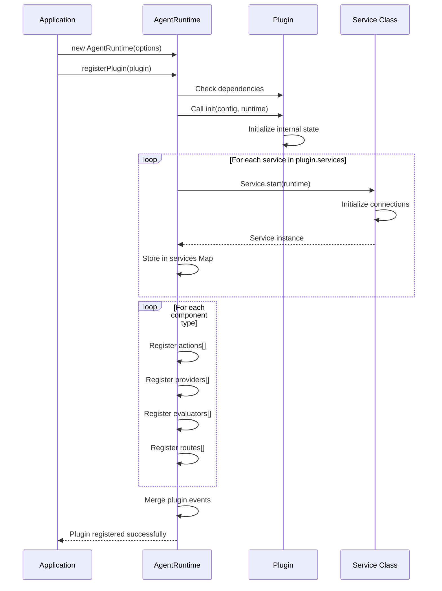

# ElizaOS - Runtime & Plugin Architecture

This diagram illustrates how the Agent Runtime manages plugins and their components.

```mermaid
graph TB
    subgraph "IAgentRuntime Interface"
        Runtime[Agent Runtime<br/>─────────<br/>agentId: UUID<br/>character: Character<br/>messageService<br/>stateCache]

        subgraph "Component Registries"
            ActionRegistry[Actions Array]
            ProviderRegistry[Providers Array]
            EvaluatorRegistry[Evaluators Array]
            ServiceRegistry[Services Map]
            RouteRegistry[Routes Array]
            EventRegistry[Events Registry]
        end

        subgraph "Core Runtime Methods"
            RegisterPlugin[registerPlugin]
            RegisterService[registerService]
            GetService[getService]
            ProcessActions[processActions]
            Evaluate[evaluate]
            ComposeState[composeState]
            UseModel[useModel]
        end
    end

    subgraph "Plugin Structure"
        Plugin[Plugin Interface<br/>─────────<br/>name: string<br/>description: string]

        PluginActions[actions?: Action[]]
        PluginProviders[providers?: Provider[]]
        PluginEvaluators[evaluators?: Evaluator[]]
        PluginServices[services?: Service[]]
        PluginRoutes[routes?: Route[]]
        PluginEvents[events?: PluginEvents]
        PluginInit[init?: Function]

        Plugin --> PluginActions
        Plugin --> PluginProviders
        Plugin --> PluginEvaluators
        Plugin --> PluginServices
        Plugin --> PluginRoutes
        Plugin --> PluginEvents
        Plugin --> PluginInit
    end

    subgraph "Plugin Lifecycle"
        Load[1. Plugin Loaded]
        Init[2. init Called]
        Register[3. Components Registered]
        ServiceStart[4. Services Started]
        Ready[5. Plugin Ready]

        Load --> Init
        Init --> Register
        Register --> ServiceStart
        ServiceStart --> Ready
    end

    subgraph "Database Layer"
        DBAdapter[IDatabaseAdapter<br/>─────────<br/>PostgreSQL or PGLite]
        Runtime --> DBAdapter
    end

    Runtime --> RegisterPlugin
    RegisterPlugin --> Plugin

    PluginActions --> ActionRegistry
    PluginProviders --> ProviderRegistry
    PluginEvaluators --> EvaluatorRegistry
    PluginServices --> ServiceRegistry
    PluginRoutes --> RouteRegistry
    PluginEvents --> EventRegistry

    GetService --> ServiceRegistry
    ProcessActions --> ActionRegistry
    Evaluate --> EvaluatorRegistry
    ComposeState --> ProviderRegistry

    style Runtime fill:#4A90E2,stroke:#2E5C8A,stroke-width:3px,color:#fff
    style Plugin fill:#7B68EE,stroke:#5A4BAD,stroke-width:2px,color:#fff
    style ServiceRegistry fill:#50C878,stroke:#3A9B5C,stroke-width:2px,color:#fff
    style DBAdapter fill:#FFB84D,stroke:#CC9333,stroke-width:2px,color:#fff
```

## Plugin Registration Flow



## Component Access Patterns

### Services
```typescript
// Services are accessed via runtime.getService()
const walletService = runtime.getService<WalletService>('wallet');
await walletService.transfer(params);
```

### Actions
```typescript
// Actions are registered and invoked by runtime
runtime.registerAction(myAction);
// Runtime automatically matches and executes based on user input
```

### Providers
```typescript
// Providers are automatically called during state composition
const state = await runtime.composeState(message);
// State includes data from all registered providers
```

### Evaluators
```typescript
// Evaluators run after interactions
await runtime.evaluate(message, state, didRespond);
// All matching evaluators are executed
```

## Service Registry Architecture

```mermaid
graph LR
    subgraph "Runtime Service Management"
        Map[Services Map<br/>ServiceTypeName → Service[]]
    end

    subgraph "Service Types"
        Transcription[TRANSCRIPTION]
        Video[VIDEO]
        Browser[BROWSER]
        Wallet[WALLET]
        Message[MESSAGE]
        Custom[Custom Services via<br/>Module Augmentation]
    end

    Map --> Transcription
    Map --> Video
    Map --> Browser
    Map --> Wallet
    Map --> Message
    Map --> Custom

    style Map fill:#4A90E2,stroke:#2E5C8A,stroke-width:2px,color:#fff
    style Custom fill:#FF6B6B,stroke:#CC5555,stroke-width:2px,color:#fff
```

## Key Principles

### Plugin Isolation
- Each plugin is self-contained
- Plugins communicate through runtime APIs
- No direct plugin-to-plugin dependencies

### Service-Based State Management
- Services maintain all stateful integrations
- Actions are stateless; they delegate to services
- Providers are read-only context suppliers

### Runtime as Orchestrator
- Runtime manages component lifecycle
- Coordinates between plugins and components
- Ensures proper initialization order

### Type Safety
- TypeScript interfaces for all components
- Service type registry with module augmentation support
- Compile-time validation of component contracts

## Related Diagrams

- [High-Level Architecture](./architecture-high-level.md) - System overview
- [Monorepo Structure](./architecture-monorepo.md) - Package organization
- [Component Interactions](./architecture-components.md) - Actions, Providers, Evaluators, Services
- [Memory & UUID System](./architecture-memory.md) - Agent memory architecture
- [Architecture Overview](./architecture-overview.md) - Index of all diagrams
